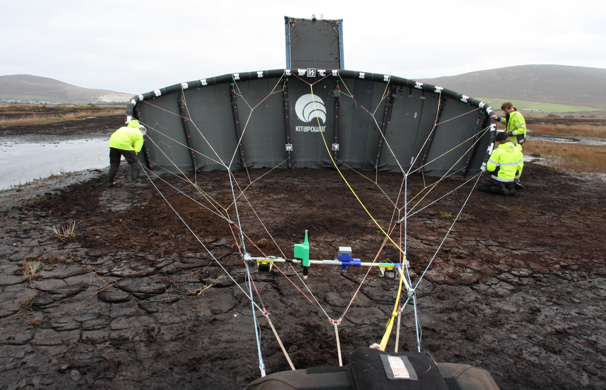
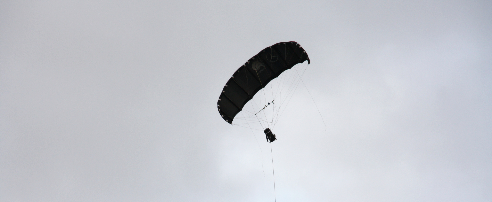
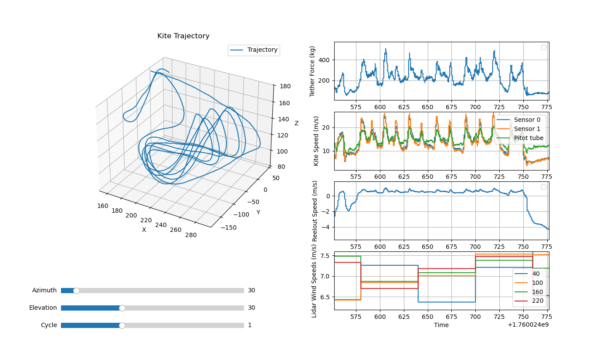

# Kitepower flight data acquired on 9 October 2025

The dataset describes a test flight conducted on 9 October 2025 at Kitepower's test site in Bangor Erris, Ireland.
The test flight spanned the time period from 17:35:11 to 18:05:09 UTC, including 4 complete pumping cycles.
The measured ground wind speed during the flight ranged from 5.728 to 9.302 m/s; the altitude of the kite varied between 77.3 and 232.7 m, with an airspeed between 8.6 and 23.1 m/s.
One of the objectives was to measure the flight deformation using digital image correlation photogrammetry, supplemented by span measurements obtained through ultra-wideband (UWB) modules.
The GPS location of the ground station was 54.126501°, -9.781143°. The pressure in the tubes of the LEI kite was 277 mbar.

Preparing the instrumented V3 kite for launch. Photo by Pim Haanen, 9 October 2025.

Instrumented V3 kite in flight. Photo by Pim Haanen, 9 October 2025.

## System configuration 

For this specific test, the 25 m² leading-edge inflatable V3 kite was flown with conservative operational settings and substantially overdimensioned KCU.
The primary focus of the test was data acquisition and sound measurements rather than maximizing energy production.
As a result, the power output during the flight was significantly lower than that of standard Kitepower operations.
The main system parameters are listed in the following table. For this specific tes, the system was not fitted with the onboard ram-air turbine.

| **Kite**                     |           | **Tether**   |           | **KCU**         |           |
|------------------------------|-----------|--------------|-----------|-----------------|-----------|
| Total wing area              | 25 m²     | Density      | 724 kg/m³ | Diameter        | 0.46 m    |
| Projected wing area          | 19.75 m²  | Diameter     | 13.5 mm   | Length          | 0.95 m    |
| Total mass                   | 18 kg     |              |           | Total mass      | 23.25 kg  |

The following video, recorded by the swivel camera of the ground station, shows four concatenated segments of the flight test: 1) the launch maneuver and one figure-of-eight downloop, 2) one reel-in maneuver with depowered kite, 3) a reel-in maneuver with a rapidly descending kite and extreme slack developing such that the tether eventually drops to the ground, and 4) the termination of the test flight by landing the kite in paraglider mode in front of the ground station. 

https://github.com/user-attachments/assets/d64c8d63-0ec3-479e-b0ca-5528cb20493d

With a wing surface area of 25 m², the V3 kite is too small for the relatively low wind speeds, and the heavy kite control unit and tether. As a consequence, the tether slack experienced during flight is substantial. When ascending against gravity, the kite decelerates, and the tether slack increases. When flying downwards, the kite is accelerated by gravity, and the slack decreases again. The interplay of these effects leads to complex shape dynamics of the tether. In the third segment, the kite descends faster than the ground station (GS) can reel in the tether. The slack is developing to such a degree that the tether eventually drops to the ground. In the last segment, the automatic return-to-home (RTH) controller lands the kite in paraglider mode safely in front of the ground station.

Because the commonly used larger kites develop larger aerodynamic forces, the maximum speed limit of the ground station is generally not reached during reel-in.

## Key measurements include:

- **Position, Orientation, Velocities, and Accelerations**: Recorded at two of the kite’s central struts using Pixhawk IMU+GPS systems, encompassing translational and rotational kinematics.
- **Airflow Measurements**: Collected using a pitot tube and wind vanes to measure angle of attack, sideslip angle, apparent windspeed and airspeed temperature. The sensor was installed on a bar in the front bridle lines of the kite.
- **Ground Station Measurements**: Measured at the ground station, tether length, tether force, mechanical power, mechanical depower, reelout speed.
- **Control Inputs**: Depower and steering inputs.
- **Lidar Data**: Collected at a 1-minute resolution, acquired with a Windcube v2.

*Data plotted for the 2nd pumping cycle.*

## Terms and requests concerning using the data:
The contents of this repository are published under a CC BY-NC 4.0 license: the data can be used as long as attribution is made to this repository. Nevertheless, if you pursue a publication that uses the data we request you to:
- Stress that the test flight does not represent the state-of-the-art of Kitepower as (1) the system configuration was already dated at the time of the test and has gone through substantial development since then and (2) the test was focused on data acquisition rather than maximising energy production;
- Acknowledge Kitepower and include a link to https://thekitepower.com;
- Send the preprint including the data via email to publications@kitepower.nl;
- Allow Kitepower to post the preprint of the publication on kitepower.nl and/or Kitepower-related networks, if such public posting is in accordance with the agreement between author and publisher.

## Wind estimation via EKF

We recommend using the [EKF-AWE](https://github.com/ocayon/EKF-AWE) repository for Extended Kalman Filter–based ambient wind estimation from flight data.

## Content of the data set

The acquired data is provided in csv-format. In the content description, we use the following abbreviations:
- NED: North-East-Down earth-fixed reference frame
- FRD: Forward-Right-Down body-fixed reference frame

### Kite kinematics measurements

- kite_0: Pixhawk unit 0 - Mounted on the central strut of the kite
- kite_1: Pixhawk unit 1 - Mounted on the kite control unit (KCU)

The kite position data is derived from measurements taken by Pixhawk unit 0 and processed using the default Kalman filter implementation provided by Pixhawk.

### Lidar measurements
The lidar system captures wind measurements at multiple heights (40m to 250m) at 1-second intervals, which are aggregated into 1-minute statistics in the dataset. These measurements include the mean, maximum, and minimum wind speeds, standard deviation of wind speeds, wind direction, vertical wind component (z-wind), Doppler spectrum broadening, Carrier-to-Noise Ratio (CNR), and data availability. Data are organized by height, with the height (e.g., 40m, 60m, etc.) indicated in the variable name.

## Variables

| Variable                        | Description                                                                                                                                                                                   | Unit             |
|---------------------------------|-----------------------------------------------------------------------------------------------------------------------------------------------------------------------------------------------|------------------|
| time                            | Unix timestamp: number of seconds since 0:00 UTC on January 1, 1970                                                                                                                           | s                |
| date                            | Date                                                                                                                                                                                           | dd-mm-yyyy       |
| time_of_day                     | Time                                                                                                                                                                                           | hh:mm:ss (UTC+2) |
| kite_{sensor_id}_vx             | x-component of the kite velocity in the NED earth reference frame                                                                                                                              | m/s              |
| kite_{sensor_id}_vy             | y-component of the kite velocity in the NED earth reference frame                                                                                                                              | m/s              |
| kite_{sensor_id}_vz             | z-component of the kite velocity in the NED earth reference frame                                                                                                                              | m/s              |
| kite_{sensor_id}_roll           | Roll angle as part of the 3-2-1 Euler sequence to get from the NED earth to the FRD body reference frame                                                                                        | deg              |
| kite_{sensor_id}_pitch          | Pitch angle as part of the 3-2-1 Euler sequence to get from the NED earth to the FRD body reference frame                                                                                     | deg              |
| kite_{sensor_id}_yaw            | Yaw angle as part of the 3-2-1 Euler sequence to get from the NED earth to the FRD body reference frame                                                                                       | deg             |
| kite_{sensor_id}_longitude       | Geodetic longitude of the kite                                                                                                                                                               | deg              |
| kite_{sensor_id}_latitude        | Geodetic latitude of the kite                                                                                                                                                                | deg              |
| kite_{sensor_id}_altitude        | Geodetic altitude of the kite                                                                                                                                                                | m                |
| ground_upwind_direction          | Instantaneous wind direction measured at ground level, relative to North, clockwise positive    | deg      |
| ground_wind_velocity              | Instantaneous wind speed measured at ground level                                              | m/s          |
| ground_tether_reelout_speed       | Reel-out speed of the tether (inferred from the rotational speed of the drum)                                                                                                               | m/s              |
| ground_tether_force               | Tether force measured at the ground station (inferred from load cell at outlet pulley and tether angle)                                                                                     | kg               |
| ground_tether_length              | Total length of the tether deployed from the ground station                                                                                                                                 | m                |
| kite_pos_east                     | Position of the kite east of the ground station (derived primarily from sensor 0 measurements)                                                                                              | m                |
| kite_pos_north                    | Position of the kite north of the ground station (derived primarily from sensor 0 measurements)                                                                                             | m                |
| kite_height                       | Height of the kite relative to the ground station (derived primarily from sensor 0 measurements)                                                                                            | m                |
| kite_elevation                    | Elevation angle from the ground in the wind reference frame                                   | rad              | 
| kite_azimuth                      | Azimuth of the kite in the wind reference frame                                           | rad              |
| kite_distance                     | Kite distance from the ground station                                                     | m                 |
| kite_heading                      | Angle between the axis pointing up and the kite x-axis projection onto the tangential plane, clockwise positive when viewed from above the kite towards the origin                            | rad              |
| kite_course                       | Angle between the axis pointing up and the kite velocity projection onto the tangential plane, clockwise positive when viewed from above the kite towards the origin                          | rad              |
| kite_actual_steering              | Level of realized steering actuation as a percentage of the range in one direction                                                                                                            | %                |
| kite_actual_depower               | Level of realized depower as a percentage of the full range                                                                                                                                   | %                |
| kite_set_steering                 | Set/desired value of steering actuation as a percentage of the range in one direction                                                                                                         | %                |
| kite_set_depower                  | Set/desired depower as a percentage of the full range                                                                                                                                         | %                |
| ground_mech_energy                | Generated mechanical energy at the winch since the start of the test flight                                                                                                                   | J                |
| ground_mech_power                 | Mechanical power measured at the winch                                                                                                                                                         | W                |
| kite_turn_rate                    | Rate of change of the kite's heading angle (turning speed), clockwise positive when viewed from above                                                                                         | rad/s            |
| kite_course_rate              | Rate of change of the kite course angle                                                    | rad/s     |
| flight_phase                      | Label of the active flight phase: `pp-ro` = reel-out, `pp-ri` = reel-in, `pp-rori` = reel-out to reel-in transition, `pp-riro` = reel-in to reel-out transition                                | -                |
| flight_phase_index                | Index of the active flight phase: `1` = reel-out, `2` = reel-in, `3` = reel-out to reel-in transition, `4` = reel-in to reel-out transition                                                     | -                |
| airspeed_temperature          | Temperature measured at the airspeed probe                                                 | °C           |
| airspeed_angle_of_attack      | Angle of attack of the airspeed relative to the body-fixed reference frame                 | deg     |
| airspeed_sideslip_angle       | Sideslip angle of the airspeed relative to the body-fixed reference frame                  | deg      |
| airspeed_apparent_windspeed   | Apparent wind speed measured by the airspeed probe                                         | m/s          |
| {height} Wind Speed (m/s)        | Average wind speed at 200 meters height over 1 minute                                          | m/s          |
| {height} Wind Speed Dispersion (m/s) | Standard deviation of wind speed at 200 meters height over 1 minute                      | m/s          |
| {height} Wind Speed min (m/s)    | Minimum wind speed at 200 meters height over 1 minute                                          | m/s          |
| {height} Wind Speed max (m/s)    | Maximum wind speed at 200 meters height over 1 minute                                          | m/s          |
| {height} Wind Direction (°)      | Average clockwise upwind direction from the North at 200 meters height over 1 minute                                     | deg      |
| {height} Z-wind (m/s)            | Vertical wind component at 200 meters height over 1 minute                                    | m/s          |
| {height} Z-wind Dispersion (m/s) | Standard deviation of the vertical wind component at 200 meters height over 1 minute          | m/s          |
| {height} CNR (dB)                | Average Carrier-to-Noise Ratio (CNR) at 200 meters height over 1 minute                      | dB           |
| {height} CNR min (dB)            | Minimum Carrier-to-Noise Ratio (CNR) at 200 meters height over 1 minute                      | dB           |
| {height} Dopp Spect Broad (m/s)  | Doppler spectrum broadening at 200 meters height over 1 minute                                | m/s          |
| {height} Data Availability (%)   | Percentage of valid data collected at 200 meters height over 1 minute                         | %            |

# Authors

Roland Schmehl¹ (email: r.schmehl@tudelft.nl), Pim Haanen¹˒², Jelle Poland¹, Oriol Cayon¹, Wolf Fisscher², Mark Devas³, Padraic Doherty³, Pepijn Ubbels³, Stijn Gielen³.

¹ Faculty of Aerospace Engineering, Delft University of Technology, Kluyverweg 1, 2629 HS Delft, The Netherlands

² [Kitepower B.V.](https://thekitepower.com), Schieweg 15, Hall R, 2627 AN Delft, The Netherlands

³ Kitepower Test Facility, Tawnanasool, County Mayo, Ireland

## License

This dataset is licensed under the 

## Acknowledgements

This project MERIDIONAL has received funding from the European Union’s Horizon Europe research and innovation programme under grant agreement No [101084216](https://doi.org/10.3030/101084216). The opinions expressed in this document reflect only the author’s view and reflects in no way the European Commission’s opinions. The European Commission is not responsible for any use that may be made of the information it contains.
